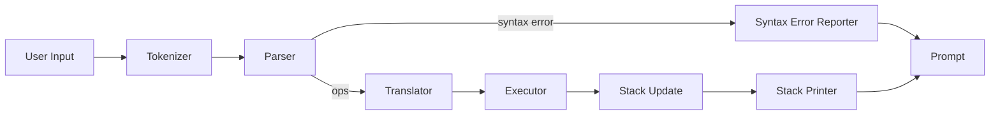

# AsmLang - Language in Assembly

A modular Reverse Polish Notation (RPN) calculator implemented in x86-64 assembly language using NASM syntax. Supports numbers, strings, arrays, variables, and continuation literals with `&`, `...`, and `!`.

## Demo

[Demo](/Resources/Demo1.gif)

## Features

- REPL (Read-Eval-Print Loop) for interactive calculations
- Basic arithmetic: `+`, `-`, `*`, `/`
- Variable support with C-style naming (start with letter or `_`, contain letters, digits, `_`)
- Label quoting with `'name` (pushes the variable label) and `#` to store a value into that label
- Forth-style stack words: `clear`, `drop`, `swap`, `dup`, `over`, `rot`, `depth`
- Comparison helpers: `eq`, `gt`, `lt` push `1` (true) or `0` (false)
- Boolean conveniences (`true`, `false`) and `assert` to guard invariants inline
- String literal support with Pascal-style storage (quoted input, `+` concatenation)
- Array literal support via `[ ... ]` tokens — arbitrary nesting of numbers, strings, or arrays
- Continuation literals via `{ ... }`, executed with `&`, resumed with `...`, tail-replaced with `!`
- Array collapse: when a continuation produces multiple stack values, they are automatically collapsed into a single array value
- Modular architecture: tokenizer, parser, translator, executor, stack ops
- CMake build system
- Automated shell-based regression tests
- Prints the top of stack after each evaluation cycle

## Build

### Linux / WSL2

```bash
mkdir build && cd build
cmake ..
make
```

### Windows (native PowerShell)

The binary targets Linux ELF64 and uses Linux syscalls throughout, so it must be assembled and run under WSL2. Native Windows linking is not supported without a full syscall port.

Prerequisites in WSL2:

```bash
sudo apt install nasm cmake make
```

Build from PowerShell:

```powershell
wsl -- bash -c "cd /mnt/c/Users/chris/local/repos/AsmLang && mkdir -p build bin && cd build && cmake .. && make"
```

Run from PowerShell:

```powershell
wsl -- /mnt/c/Users/chris/local/repos/AsmLang/bin/rpn
```

Add a permanent alias to `$PROFILE`:

```powershell
function rpn   { wsl -- /mnt/c/Users/chris/local/repos/AsmLang/bin/rpn $args }
function Build-AsmLang { wsl -- bash -c "cd /mnt/c/Users/chris/local/repos/AsmLang/build && make 2>&1" }
```

## Run

```bash
../bin/rpn
```

## Tests

```bash
./tests/run_tests.sh   # full regression suite
./r                    # rebuild + full suite
```

## Usage

```
λ 3 4 +
λ 7
λ 42 'answer #
λ answer
λ 42
λ [1 2 3]
λ [1 2 3]
λ { 5 3 + } &
λ 8
λ { 1 { 2 } & ... } &
λ [1 2]
λ 1 +
Stack underflow
λ 1
```

Press `Ctrl+D` to exit.

Colors are enabled automatically when stdout is a TTY. Override with `--color` or `--no-color`.

## Architecture

Each module is a separate `.asm` file assembled as its own translation unit and linked together:

| Module | File | Role |
| --- | --- | --- |
| Tokenizer | `tokenizer.asm` | Splits input into tokens |
| Parser | `parser.asm` | Parses tokens into operations; enforces syntax (`4+` is a syntax error, `4 +` is valid) |
| Translator | `translator.asm` | Translates operations to bytecode |
| Executor | `executor.asm` | Executes bytecode; includes `stack_ops.asm`, `op_handlers.asm`, `execute_core.asm`, `execute_continuation.asm`, `print_stack.asm`, `strings.asm` via `%include` |
| Stack ops | `stack_ops.asm` | `push_num`, `push_str`, `push_type`, `pop`, `pop_num`, `pop_bool`, `collapse_stack_slice_to_array` |
| Entry point | `main.asm` | REPL loop, BSS declarations, global symbol exports |

### REPL pipeline



### Value representation

The stack is a parallel pair of arrays declared in `main.asm`:

```nasm
stack       resq 10000   ; 8-byte values
stack_types resb 10000   ; type tag per entry
stack_top   resq 1       ; count (not pointer)
```

| Type tag | Constant | Value in `stack[i]` |
| --- | --- | --- |
| Number | `TYPE_NUM  equ 0` | 64-bit signed integer |
| String | `TYPE_STR  equ 1` | Pointer to `{qword len, bytes...}` |
| Array  | `TYPE_ARRAY equ 2` | Pointer to `{qword len, bytes...}` (rendered text) |
| Bool   | `TYPE_BOOL equ 3` | `1` (true) or `0` (false) |
| Continuation | `TYPE_CONT equ 4` | Index into `cont_literal_offsets` |
| Label  | `TYPE_LABEL equ 5` | Hash of the variable name |

Strings and arrays share the same `{length, data}` layout. Arrays store their rendered text (e.g. `[ 1 2 3 ]`) so printing is a single `write` syscall.

### Array collapse

When a continuation executes and leaves more than one new value on the stack, `collapse_stack_slice_to_array` (in `stack_ops.asm`) is called. It:

1. Iterates the slice `[base .. stack_top)`, formatting each value into a `[ v0 v1 ... ]` text buffer allocated in `cont_storage` (a 64 KB bump-allocated region)
2. Writes the text length as a qword prefix
3. Rewinds `stack_top` to the slice base
4. Pushes a single `TYPE_ARRAY` value pointing at the new buffer

## Literal syntax

| Literal | Example | Notes |
| --- | --- | --- |
| Integer | `42`, `-13` | Bare decimal token |
| String | `"hello"` | Pascal-style pool storage; `+` concatenates |
| Array | `[1 2 3]`, `[[1 2] "x"]` | Stored as rendered text; nested arrays supported |
| Continuation | `{ 1 2 + }` | Data until executed with `&` |
| Label | `'answer` | Pushes variable handle for use with `#` |
| Bool | `true`, `false` | Push `1` or `0` |

## Word reference

### Stack words

| Word | Stack effect | Notes |
| --- | --- | --- |
| `dup` | `x -- x x` | Duplicates top (any type) |
| `over` | `x1 x2 -- x1 x2 x1` | Copies second to top |
| `rot` | `x1 x2 x3 -- x2 x3 x1` | Rotates top three (Forth semantics) |
| `depth` | `-- n` | Pushes current stack depth |
| `clear` | `... --` | Empties the stack |
| `drop` | `x --` | Discards top |
| `swap` | `x1 x2 -- x2 x1` | Swaps top two |

### Arithmetic

| Word | Stack effect |
| --- | --- |
| `+` | `a b -- a+b` |
| `-` | `a b -- a-b` |
| `*` | `a b -- a*b` |
| `/` | `a b -- a/b` |

### Comparison & logic

| Word | Stack effect | Notes |
| --- | --- | --- |
| `eq` | `a b -- flag` | `1` if `a == b` |
| `gt` | `a b -- flag` | `1` if `a > b` |
| `lt` | `a b -- flag` | `1` if `a < b` |
| `true` | `-- 1` | |
| `false` | `-- 0` | |
| `assert` | `flag --` | Exits with error if flag is zero |

### Variables

| Word | Stack effect | Notes |
| --- | --- | --- |
| `'name` | `-- label` | Pushes variable label (hash) |
| `#` | `value label --` | Stores value into label |

### Continuations

| Word | Stack effect | Notes |
| --- | --- | --- |
| `{ ... }` | `-- cont` | Pushes continuation literal without executing |
| `&` | `cont -- result...` | Executes continuation in captured scope |
| `...` | `--` | Returns from current continuation; error at top level |
| `!` | `cont --` | Tail-replaces current continuation |

## Error handling

- **Stack underflow**: detected before arithmetic executes; prints red `Stack underflow` (if color enabled) and re-prompts without crashing
- **Syntax errors**: abort the line before translation; e.g. `4+` prints `Syntax error: 4` and leaves the previous stack untouched
- **Colors**: auto-detected via TTY; override with `--color` / `--no-color`

## Testing

```bash
./r                                   # rebuild + full regression suite
printf '3\n\n' | ./bin/rpn
printf -- '-3\n\n' | ./bin/rpn
printf '1 2\n\n+\n\n+\n' | ./bin/rpn
printf '+\n' | ./bin/rpn --color
printf '{ 42 } &\n' | ./bin/rpn --no-color
printf '{ 1 { 2 } & ... } &\n' | ./bin/rpn --no-color
tests/stack_words_test.sh
tests/run_tests.sh
```

## Limitations

- Integer arithmetic only; no floating point
- Stack depth capped at 10,000 elements
- `cont_storage` (array/string bump allocator) is 64 KB; deep continuation nesting or large array collapses will exhaust it
- ELF64 binary; requires Linux or WSL2 to run — no native Windows PE support without porting syscalls to Win32
